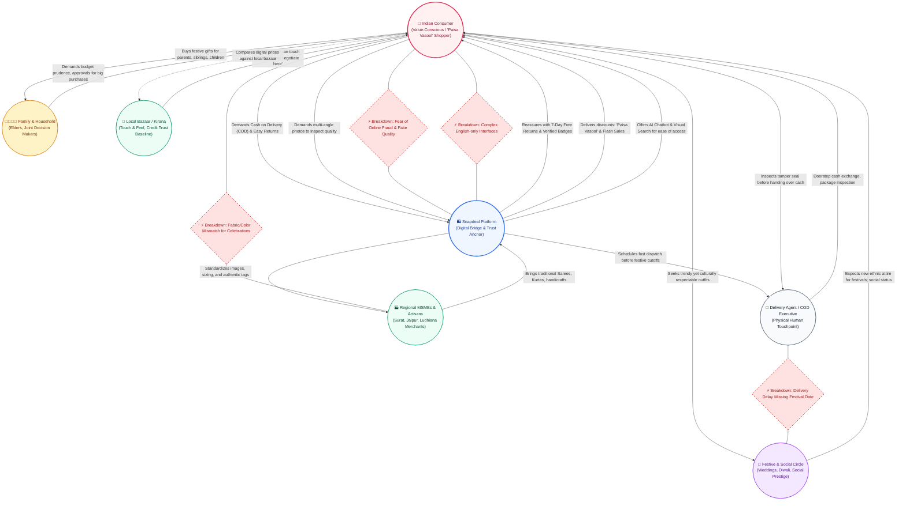

# Cultural Model: Snapdeal E-Commerce Platform
**Methodology:** Contextual Design (Beyer & Holtzblatt)  
**Target Ecosystem:** Indian Tier-1 to Tier-3 Consumer & Festive Commerce  
**Platform:** Snapdeal Full-Stack E-Commerce Web Application  
**Date:** October 2026  

---

## 1. Executive Summary

In Human-Computer Interaction (HCI) and Contextual Design, the **Cultural Model** diagrams the cultural expectations, social pressures, taboos, trust boundaries, influencers, and informal values that dictate how users behave, decide, and purchase within an ecosystem.

Unlike Western e-commerce paradigms that assume high credit-card penetration, high initial trust, individualistic self-purchasing, and standardized sizing, the **Indian E-Commerce Context (Bharat Consumer)** is deeply collectivistic, value-obsessed (*Paisa Vasool*), festival-anchored, family-influenced, and wary of counterfeit or misrepresented goods.

This document maps the cultural forces shaping Snapdeal's users and translates these cultural pressures into architectural and UI/UX design interventions.

---

## 2. Contextual Design Cultural Model Diagram

The diagram below maps the **cultural influencers (bubbles)**, **cultural expectations & pressures (directional arrows)**, and **cultural breakdowns / conflict points (lightning bolts / breakdowns)** operating in the Snapdeal ecosystem.

---

## 3. Core Cultural Forces & Values

| Cultural Force | Local Term / Concept | Description | Influence on Shopping Behavior |
| :--- | :--- | :--- | :--- |
| **Value Maximization** | *Paisa Vasool* | Deep desire to extract maximum possible value for every rupee spent. | Users obsessively compare original MRP vs. discounted price; love free shipping, bundled offers, and flash sales. |
| **Prepaid Payment Skepticism** | *Haath Mein Maal, Phir Cash* | Hesitation to pay online before seeing physical items; fear of lost money or card fraud. | Drives overwhelming demand for **Cash on Delivery (COD)** and transparent return policies. |
| **Occasion Auspiciousness** | *Shubh Muhurat / Tyohar* | Shopping surges aligned with festivals (Diwali, Dussehra, Pongal, Eid, Karwa Chauth, Weddings). | Strict delivery deadlines: receiving wedding or Diwali attire one day late renders it useless. |
| **Collectivist / Family Consultation** | *Parivaar Ki Pasand* | Major lifestyle, ethnic wear, and household purchases involve inputs from spouses, parents, or siblings. | Heavy sharing via WhatsApp, shared wishlists, joint cart reviews before checkout. |
| **Sensory Verification Need** | *Chhookar Dekhna* (Touch & Feel) | Traditional bazaar habits rely on feeling the fabric, checking seams, and examining shoe soles. | High anxiety over single-image listings; strong demand for **multi-angle galleries** (front, back, texture, side). |
| **Vernacular & Simplicity Need** | *Aasan aur Saral* | Diverse linguistic backgrounds and varying digital literacy levels outside Tier-1 metros. | High friction with jargon-heavy checkouts; appreciation for icon-driven categories and visual search. |

---

## 4. Key Cultural Breakdowns & Design Solutions

### Breakdown 1: Quality & Authenticity Skepticism
* **Cultural Anxiety:** *"What if I receive a cheap replica or a torn cloth instead of what is shown?"*
* **Platform Intervention:**
  - **Multi-Perspective Visuals:** Every product displays 3 to 4 angles (e.g., shoe profile, outsole grip, heel detail; clothing front, reverse, fabric close-up).
  - **Trust Badges:** Prominent displays of *"Snapdeal Verified"*, *"100% Genuine Guarantee"*, and *"7-Day Hassle-Free Returns"*.
  - **Real Unboxing & Verified Customer Reviews:** Photo reviews with ratings breakdown to build social proof.

### Breakdown 2: Payment Security & Prepaid Phobia
* **Cultural Anxiety:** *"I don't trust entering card details or UPI on an unknown seller; money might get deducted with no delivery."*
* **Platform Intervention:**
  - **Cash on Delivery (COD) as First-Class Citizen:** Prominently featured at checkout with zero prejudice.
  - **Transparent Price Breakdown:** Clear itemized bill showing MRP, Instant Discount, Delivery Charges (Free above threshold), and Final Total with no hidden convenience fees.
  - **Order Tracking & SMS/WhatsApp Updates:** Reassuring notifications at every milestone (Dispatched -> In Transit -> Out for Delivery).

### Breakdown 3: Festival Timeline Urgency
* **Cultural Anxiety:** *"The wedding is on Friday. If this Kurta arrives on Saturday, my money and occasion are ruined."*
* **Platform Intervention:**
  - **Estimated Delivery by Date:** Showing exact arrival dates rather than vague "3–7 business days".
  - **Pincode Verification:** Instant delivery date check right on the product page.
  - **Express Dispatch Indicators:** Highlighting items ready for 24-48 hour dispatch.

### Breakdown 4: Traditional & Ethnic Representation
* **Cultural Expectation:** Indian shoppers seek culturally authentic clothing (Kanjivaram/Banarasi Sarees, Cotton Kurtas, Mojaris, Festive Jewellery) alongside modern fashion.
* **Platform Intervention:**
  - **Dedicated Traditional Wear Categories:** Curated Men's & Women's Ethnic Collections.
  - **Fabric & Occasion Filters:** Filtering by Silk, Cotton, Rayon, Festive, Daily Wear, Wedding.
  - **Culturally Relevant Color Palettes:** Festive maroons, saffron, royal blue, emerald green, and gold tones.

---

## 5. Persona Cultural Profiles

### Persona A: "Ramesh" – The Tier-2 Pragmatic Value Hunter
* **Age / Location:** 38, Bareilly (Uttar Pradesh)
* **Cultural Context:** Runs a grocery business, buys for his family. Uses Android smartphone with WhatsApp and YouTube.
* **Cultural Drivers:**
  - Maximizes discounts; looks for free delivery.
  - Always selects Cash on Delivery.
  - Values practical durables (shoes with tough soles, cotton shirts for daily heat).
* **Snapdeal Feature Fit:** Clear price slash badges (e.g. `65% OFF`), COD checkout, multi-angle sole inspection, quick customer support.

### Persona B: "Sunita" – The Festive Homemaker & Family Curator
* **Age / Location:** 44, Jaipur (Rajasthan)
* **Cultural Context:** Manages the household budget, coordinates purchases for upcoming Diwali and wedding seasons.
* **Cultural Drivers:**
  - High aesthetic standards for ethnic attire and home decor.
  - Relies on family consensus (shares product links on WhatsApp family group).
  - Anxious about synthetic fabrics masquerading as pure silk or cotton.
* **Snapdeal Feature Fit:** High-definition fabric close-ups, clear care instructions, festive deal bundles, generous return window.

### Persona C: "Aakash" – The Aspirational Tier-1/Tier-2 Youth
* **Age / Location:** 22, Pune (Maharashtra)
* **Cultural Context:** College student / first-job aspirant navigating global trends with budget constraints.
* **Cultural Drivers:**
  - Desires branded looks (sneakers, smartwatches, fast fashion) at accessible prices.
  - Fast-paced, uses UPI / digital payments when trusted.
  - Values peer validation and visual search (takes photo of friend's sneakers to find similar).
* **Snapdeal Feature Fit:** Visual Search Modal (image upload), Trending/Flash Sale counter, clean modern UI.

---

## 6. How the Codebase Implements This Cultural Model

1. **Category Taxonomy (`src/data/categories.ts` & `src/components/MegaMenu.tsx`):**
   - Elevated Indian traditional wear: Sarees, Lehengas, Kurtas, Ethnic Footwear, Puja & Festive Home Accents.
2. **Visual Inspection Engine (`src/pages/ProductPage.tsx` & `src/data/products.ts`):**
   - Multi-perspective galleries enabling users to inspect front, back, side angles and textures, mitigating "Touch & Feel" anxiety.
3. **Trust & Reassurance Infrastructure (`src/components/TrustSection.tsx` & `src/pages/CheckoutPage.tsx`):**
   - Instant COD availability, transparent price summary with savings highlights, 7-day return guarantee.
4. **Search Accessibility (`src/components/VisualSearchModal.tsx` & `src/components/AIChatbot.tsx`):**
   - Multimodal search allowing shoppers to take or upload a photo to find matching items, bypassing language barriers.

---

## 7. Conclusion

By grounding the Snapdeal platform architecture in this **Contextual Design Cultural Model**, the application directly solves the psychological, social, and economic frictions unique to the Indian e-commerce consumer. It bridges the gap between traditional bazaar trust and digital modern convenience.
